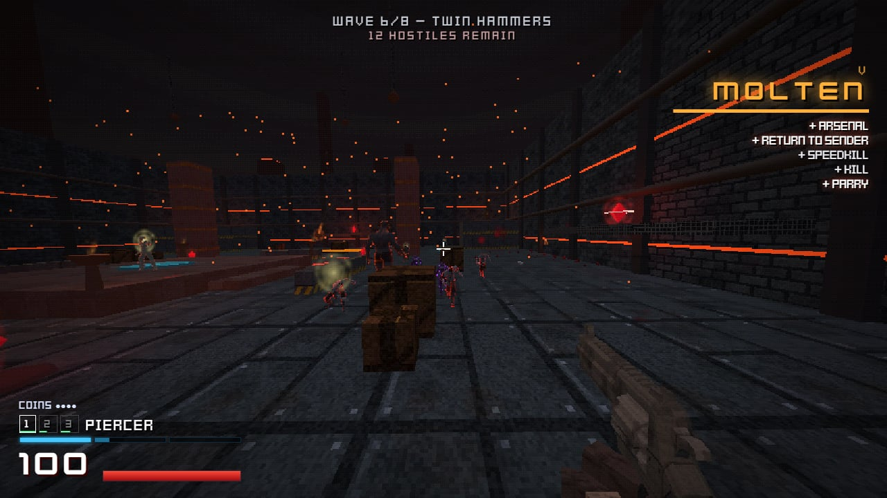
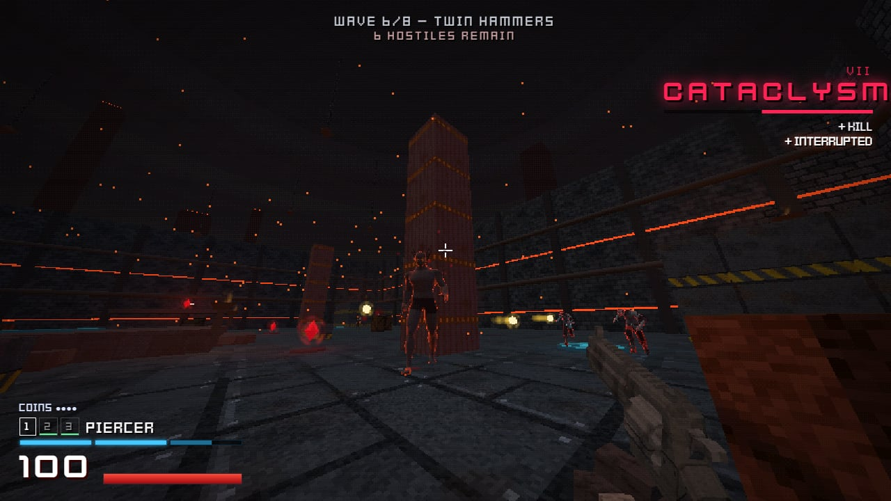
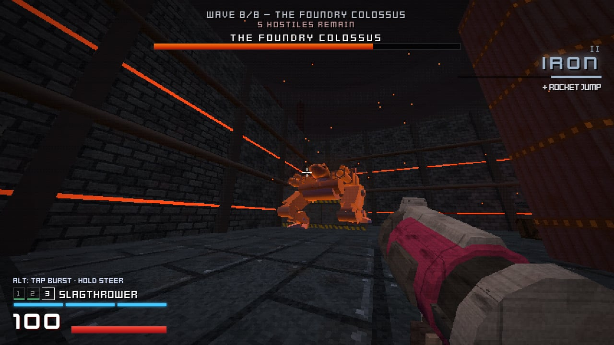
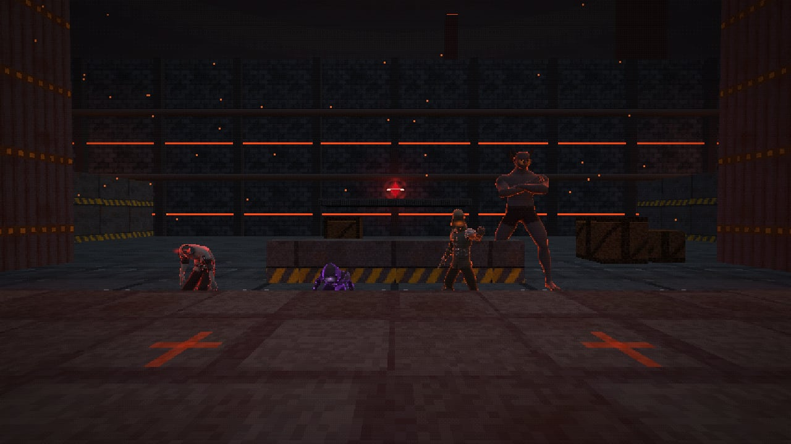
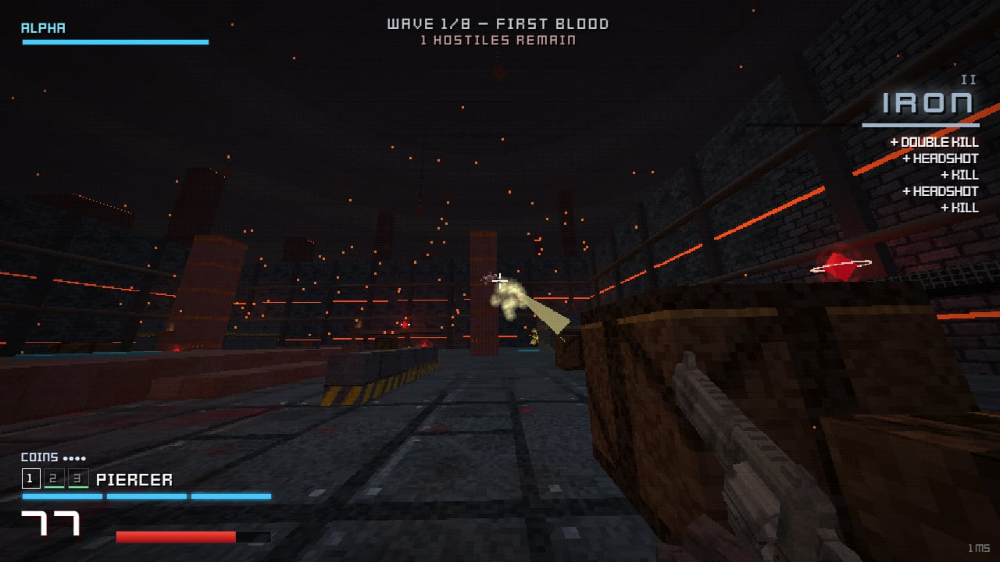

# FERROCIDE

**A fast, retro PS1-style arena shooter for the browser, with 2-player online co-op.**
Dash, slide, slam and wall-jump through a molten foundry while you shoot, parry and punch your way through eight waves and a boss. Blood is fuel: you heal by hurting things up close.

### ▶ [Play it now: ferrocide.pages.dev](https://ferrocide.pages.dev)
Runs in any modern desktop browser. No install, no account. Solo starts instantly; co-op takes a 4-letter room code.



<table>
  <tr>
    <td></td>
    <td></td>
  </tr>
  <tr>
    <td></td>
    <td></td>
  </tr>
</table>

## Features
- **Movement first.** Dash with invulnerability frames, momentum-keeping slides, ground slams that bounce you higher the further you fell, three wall jumps, rocket jumps and launch pads.
- **Three weapons, each with a trick.** Coin ricochets, a detonatable shotgun core and steerable rockets.
- **Parry anything yellow.** Punch orbs, bolts and mortars back at their owners, or punch a husk mid-swing, and heal for it.
- **Blood economy.** Damage dealt up close heals you, but part of every hit lingers as *hard damage* for a moment. Red health crystals help if you'd rather fight at range, but they respawn slowly.
- **Style ranks** from SCRAP to FERROCIDE reward variety, air kills, parries and ricochets. Kills with the same weapon over and over earn less.
- **Six enemy types and a three-phase boss**: shambling husks, blinking stalkers, orb-hurling wardens, horned brutes, flying gazers and drones, and the Foundry Colossus.
- **2-player online co-op** with room codes, drop-in joining, partner revives and reconnect on a dropped connection.
- **An original procedural soundtrack** that builds with the fight. It's synthesised live, not a recording.
- **PS1 rendering**: low internal resolution, vertex wobble, dithering and colour quantisation. The resolution is adjustable in Settings.

## Controls
| Input | Action |
|---|---|
| WASD / mouse | move / aim |
| Space | jump (3 wall jumps in the air) |
| Shift | dash (3 stamina charges, invulnerable while dashing) |
| C / Ctrl | slide on the ground · **ground slam** in the air · jump right as a slam lands to slam-bounce |
| LMB / RMB | fire / alt-fire |
| F / middle mouse | punch · **parry** yellow projectiles (pressing a beat early still counts) |
| 1 2 3 · wheel · Q | weapons · last weapon |
| Esc | pause |

## The arsenal
| Weapon | Primary | Alt-fire (RMB) |
|---|---|---|
| **PIERCER** (revolver) | Piercing hitscan with headshots. | Toss a coin, then shoot it to ricochet into the nearest head. Coins chain. |
| **SCATTERHAMMER** (shotgun) | Twelve pellets that hit hardest point-blank. A close blast staggers light enemies mid-attack. | Lob a core; shoot or punch it to set off a huge blast. |
| **SLAGTHROWER** (rocket launcher) | Rockets with splash damage. Rocket jump for height. | **Hold** to steer your rockets to the crosshair. **Tap** to airburst them. |

## Co-op
1. Player 1 picks **HOST CO-OP** and shares the 4-letter code.
2. Player 2 types the code and picks **JOIN CO-OP**. You can also join a match already in progress.
3. The host presses **START**.

The co-op server runs on a free plan and sleeps when nobody is playing. The first match after a quiet spell can take up to a minute or two to connect, and the game shows a countdown with an option to play solo instead.

## Run it locally
```bash
npm install
npm run dev
```
Open http://localhost:5173. `npm run dev` starts the Vite client (port 5173) and the Colyseus game server (port 2567) together.

For a single-process build: `npm run build`, then `npm start`. The game server also serves `dist/` on `PORT` (default 2567).

## Deployment
| Part | Host | How |
|---|---|---|
| Browser client | Cloudflare Pages (`ferrocide.pages.dev`) | Builds on every push to `main` with `npm run build:cloud`, which points co-op at the server below via `.env.cloud`. Output: `dist/`. |
| Co-op server | Render free web service (Singapore) | Defined in [`render.yaml`](render.yaml). Redeploys only when `server/`, `shared/` or the package files change. |

Solo play never touches the server: the full simulation runs in the browser.

## Architecture
```
shared/   arena collision, movement physics, the authoritative GameSim (enemies, AI, waves, pickups), protocol, tuning
server/   Colyseus room wrapping GameSim for co-op (room codes, 30 Hz simulation and snapshots), live status page
client/   Three.js renderer (low-res target + dither post), weapons, FX, HUD, audio + procedural music, interpolation
tools/    asset build scripts and a headless play-test harness
```
- **Solo** runs the same `GameSim` inside the browser.
- **Co-op**:
  - Movement is client-authoritative, so there's no input lag.
  - Enemies, damage, waves, pickups and health are server-authoritative.
  - Hit claims come from the client that saw the hit and are validated and rate-limited on the server.
  - Incoming damage is checked against the victim's own position, so dodges are judged on what the player saw.
- Humanoid enemies share one skeleton and one animation library, built from the source packs by `tools/build-humanoids.mjs`.

## Development tools
```bash
node tools/capture.mjs solo --seconds 40 --shots 6        # autoplay bot: screenshots + report.json
node tools/capture.mjs solo --wave 8 --god --seconds 30    # jump straight to the boss
node tools/capture.mjs coop --seconds 40                   # two real clients over the network
node tools/sfxprobe.mjs && node tools/mixprobe.mjs         # measure sound levels and the final mix
```
- URL flags: `?autostart=solo|host|join&code=XXXX&bot=1&mute=1&wave=N&god=1`
- Dev pages:
  - `/enemyview.html?anim=idle` shows the enemy line-up in the arena.
  - `/gunview.html?m=shotgun_b` shows gun models from the side.
- Live player status: `/status` on the game server. It's private: viewable from localhost, or with `?key=` when hosted.

## Roadmap
Next up is a **roguelike mode**:
- a branching run of generated rooms across three layers, each ending in a boss
- upgrades that change how you move and shoot, bought with style points
- unlocks between runs

The 8-wave campaign stays as **Classic**.

## Credits
All third-party assets are free to use:
- **Quaternius** (CC0): enemy, partner and weapon models; the Universal Base Characters, Modular Outfits and Universal Animation Library
- **Kenney** (CC0): particles, fonts, impact and sci-fi sound effects
- **Pixabay** (Pixabay Content License): gunshots, gore and creature sounds

The soundtrack is original and synthesised in code.
